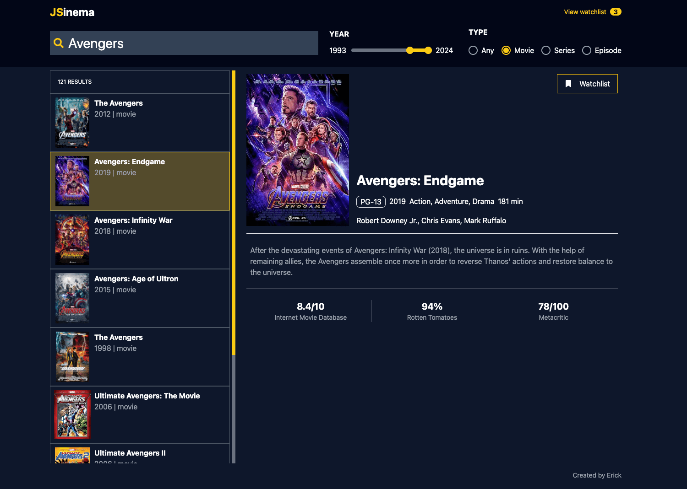

# JSinema
JSinema is a simple movie/series search web app built with [ReactJS@18](https://18.react.dev/) and [OMDb API](https://www.omdbapi.com/)



## How to get started:

### Setup Environment Variables
Reneame the file `.env.example` to `.env` and add your [OMDb API key](https://www.omdbapi.com/apikey.aspx).

### Install Dependencies
```bash
npm install
```

### Run Vite Frontend
```bash
npm run dev
```

### Build assets for Production
```bash
npm run build
```

### Preview Production Build
```bash
npm run preview
```

## Changelog
- [16/07/2024] **v1.0.0** - Initial Release